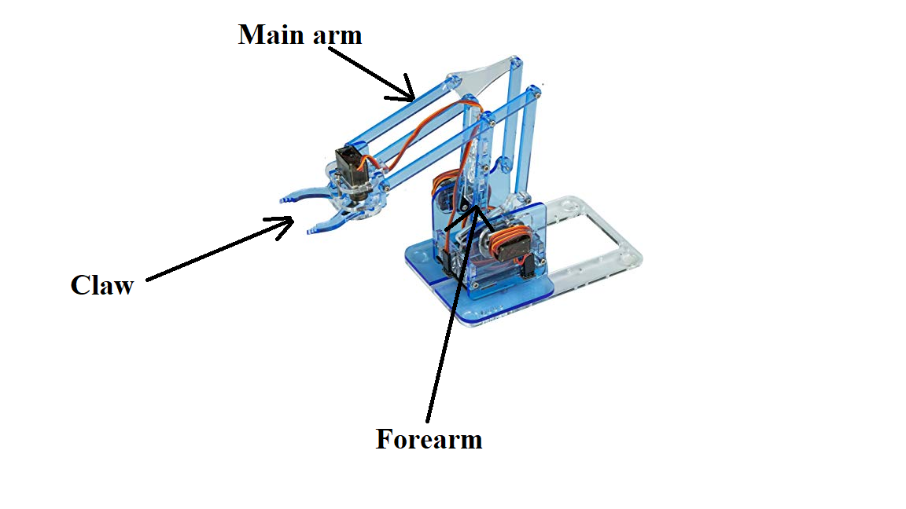
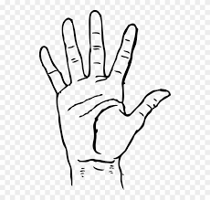

# Robot Arm Gesture

Personal project that uses OpenCV and Google's mediapipe library to control a robot arm, using the ESP32 microcontroller over serial.

The arm used was the MeArm v3, with the PCB replaced by a custom made 3D printed piece to hold the arm in place (.stl file included).

The ASL for "D", "Y" and a thumbs up gesture are used to control the claw, main arm and forearm respectively. See below for illustration.

Left Hand Control:
<ul style="list-style-type: none">
    <li>Select Claw
        </li>
</ul>

Right Hand Control:
- Open claw/move arm up
  
- Close claw/move arm down
  
  

[This](https://www.youtube.com/watch?v=a99p_fAr6e4) Youtube video by Ivan Goncharov and the [hand-gesture-recognition-mediapipe](https://github.com/kinivi/hand-gesture-recognition-mediapipe) repository were used to create this project. 
Ivan does a great job of explaining how the program uses CV to recognise hand gestures and shows how to train the model for different gestures.
Edits have been made to the app.py file in order for the hand gestures in the webcam to be used to control the ESP32.

## Get started
1. Print off the arm_base.stl file then follow the instructions[link] to build the mearm
2. Using a breadboard, connect the voltage pins of the servo motors to the 5V pin of the ESP32 board and the groud pins of the motors to the GND pin of the ESP32.
3. Connect the claw, forearm and main arm servos to pins 26, 32 and 33 respecitvely.
4. Upload the multi_python control sketch to the ESP32.
5. Follow Ivan's tutorial to setup the hand-gesture-recognition in python.
6. Change line 23 in app.py to to whatever COM port the microcontroller is connected to.

## TODO
Direct WiFi control of the arm using either MQTT, TCP or UDP.
